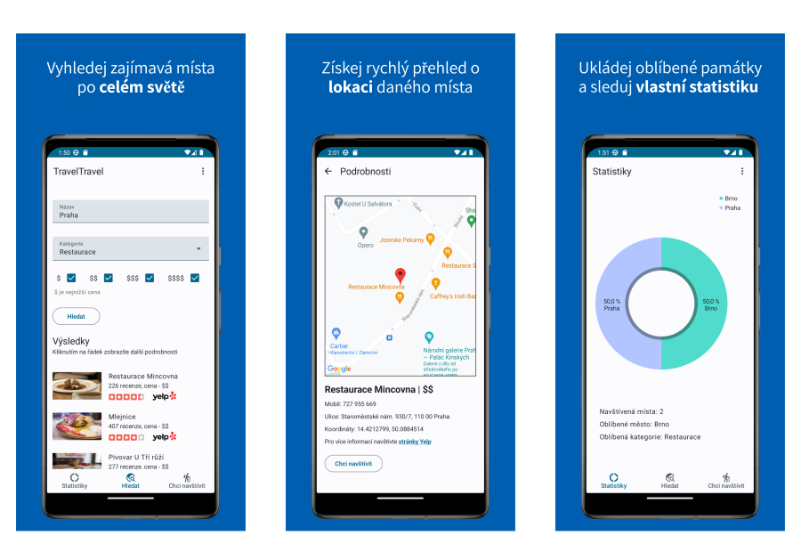

# TravelTravel

## TL;DR  
:us: Simple app for looking destinations to visit around the world.

:czech_republic: Jednoduchá aplikace pro hledání destinací k návštěvě po celém světě.

## Description

:us: TravelTravel is a simple application for travelers that searches for various interesting places such as restaurants, museums, etc. The application allows you to get a quick overview of a given place, such as location or price. This information can be saved and is automatically refreshed. Also, the application allows you to track your statistics of visited places. Data are provided by [Yelp Fusion](https://fusion.yelp.com).

:czech_republic: TravelTravel je jednoduchá aplikace pro cestovatele, která vyhledá různá zajímavá místa jako jsou například restaurace či muzea. Aplikace umožňuje získat rychlý přehled o daném místě jako jsou například lokace či cena. Tyto informace se dají uložit a automaticky se obnovují. Dále aplikace umožňuje sledovat vlastní statistiku navštívených míst. Data jsou poskytována pomocí služeb [Yelp Fusion](https://fusion.yelp.com).

## Installation
**Note:** you should have a generated [Yelp Fusion](https://fusion.yelp.com) API key for searching and [Google API key](https://developers.google.com/maps/documentation/android-sdk/get-api-key) for maps.

Download this repository and put the below code into your build.gradle(:app) file in `defaultConfig`
```gradle
Properties properties = new Properties()
properties.load(project.rootProject.file("local.properties").newDataInputStream())
manifestPlaceholders = [MAPS_API_KEY: "${properties.getProperty("MAPS_API_KEY")}"]

buildConfigField "String", "API_KEY", "\"${properties.getProperty("API_KEY")}\""
```

and your API keys to the `local.properties` like so:
```gradle
API_KEY=YOUR_YELP_FUSION_API_KEY
MAPS_API_KEY=YOUR_GOOGLE_API_KEY
```

## App Preview Assets

### App Launcher Icon


### App Screenshots



### Future Graphic

